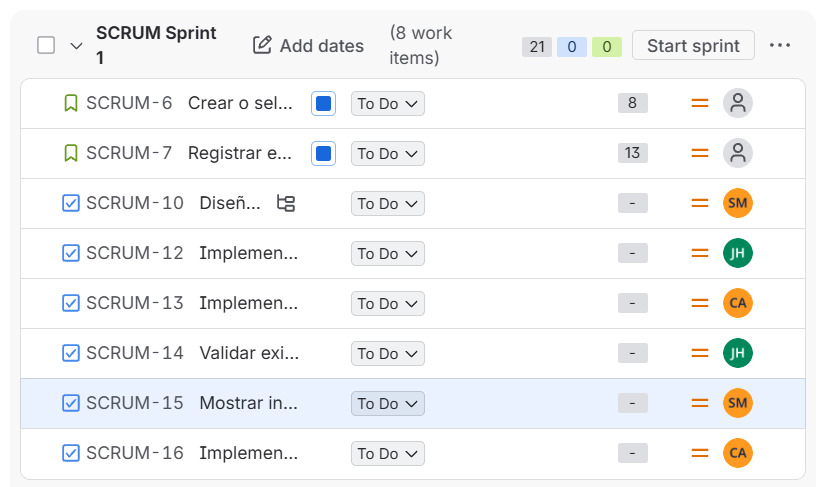

### Planificación del Sprint 1

Para el primer sprint, seleccionamos las historias de usuario **SCRUM-6** (Crear o seleccionar un equipo) y **SCRUM-7** (Registrar un equipo en el torneo activo), con un total de **21 puntos de historia**.

Decidimos priorizar estas historias porque son los pasos iniciales del proceso de registro de equipos. Crear o seleccionar un equipo es necesario antes de registrarlo en un torneo activo. Las historias de pago y validación de pago se dejaron para un sprint futuro, ya que dependen de que el proceso de registro esté disponible previamente.

Las tareas se distribuyeron entre los tres miembros del equipo para permitir el desarrollo del trabajo en paralelo, respetando las dependencias entre las tareas.