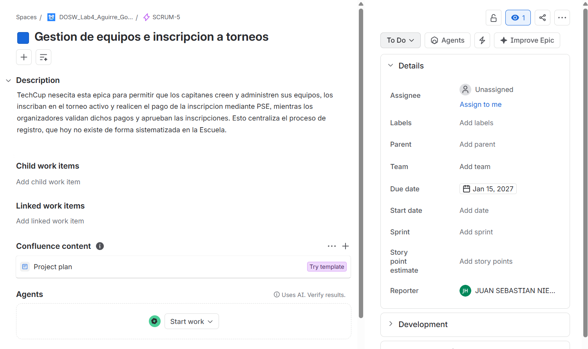

# 📄 Planeación del Sistema en Jira

## Desglose de trabajo: Épicas, Historias de Usuario y Tareas

La implementación de los requerimientos identificados de TechCup se desglosa de la siguiente manera:

### 1. Épica:

### 2. Historias de usuario:

### 3. Tareas:

### 4. Cronograma:

### 5. Backlog:

